<div align="center">

  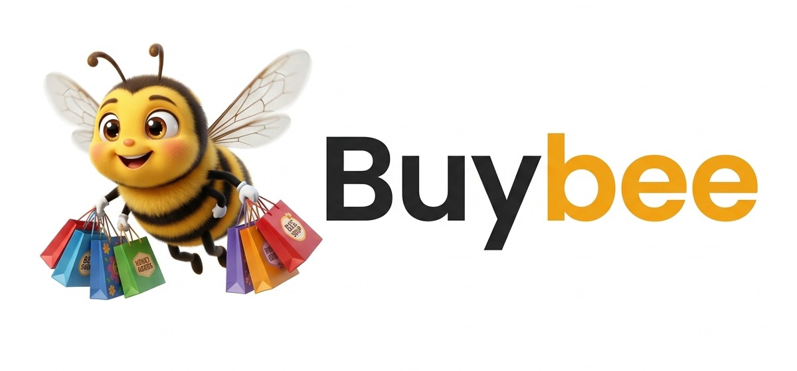

  # BuyBee — Next-Gen AI-Powered Multi-Vendor E-Commerce Platform

  <p align="center">
    <strong>An enterprise-grade, multi-role e-commerce ecosystem built with .NET 10, ASP.NET Core MVC, and an autonomous AI Shopping Assistant powered by the Model Context Protocol (MCP) and Groq LLMs.</strong>
  </p>

  <p align="center">
    <a href="#-key-features"></a>
    <a href="#-key-features"></a>
    <a href="#-architecture"></a>
    <a href="#-architecture"></a>
    <a href="#-database"></a>
    <a href="#-getting-started"></a>
  </p>

</div>

---

## 📌 Table of Contents
- [Overview](#-overview)
- [System Architecture](#-system-architecture)
- [Visual Showcase & Screenshots](#-visual-showcase--screenshots)
  - [Storefront & Catalog](#storefront--catalog)
  - [Complete End-to-End Order Lifecycle](#complete-end-to-end-order-lifecycle)
- [Role-Based Portals & Modules](#-role-based-portals--modules)
  - [1. Customer Storefront](#1-customer-storefront)
  - [2. AI Shopping Assistant (MCP + Groq)](#2-ai-shopping-assistant-mcp--groq)
  - [3. Vendor Management Portal](#3-vendor-management-portal)
  - [4. Admin Operations Hub](#4-admin-operations-hub)
  - [5. Delivery Partner Portal](#5-delivery-partner-portal)
- [Tech Stack](#-tech-stack)
- [Project Directory Structure](#-project-directory-structure)
- [Getting Started & Local Setup](#-getting-started--local-setup)
  - [Prerequisites](#prerequisites)
  - [1. Clone & Configure Environment](#1-clone--configure-environment)
  - [2. Database Setup](#2-database-setup)
  - [3. Launch the MCP Server](#3-launch-the-mcp-server)
  - [4. Launch the Web Application](#4-launch-the-web-application)
- [Model Context Protocol (MCP) Tools](#-model-context-protocol-mcp-tools)
- [Security & Environment Hygiene](#-security--environment-hygiene)
- [License](#-license)

---

## 💡 Overview

**BuyBee** is a modern, high-performance e-commerce platform designed to simulate a real-world multi-vendor retail experience. Beyond standard cart-and-checkout operations, BuyBee integrates a real-time **Model Context Protocol (MCP)** server that equips an LLM-driven AI Assistant with live database tools. Customers can converse naturally with BuyBee's AI mascot to discover products, check stock quantities, compare specifications, and navigate the store effortlessly.

The platform coordinates 4 distinct business roles in a unified solution:
1. **Customers:** Browse, search, earn & redeem **BeeCoins** loyalty rewards, track delivery milestones live, and download tax invoices.
2. **Vendors:** Manage catalog offerings, monitor stock, and pack verified incoming orders.
3. **Admins:** Oversee vendor approvals, platform catalogs, order dispatching, and partner assignments.
4. **Delivery Agents:** Execute assigned runs, manage out-for-delivery statuses, and verify customer delivery handovers via **Secure OTP Verification**.

---

## 🏗 System Architecture

BuyBee employs a decoupled, modular micro-architecture separating the client MVC application from the tool-providing MCP microservice:

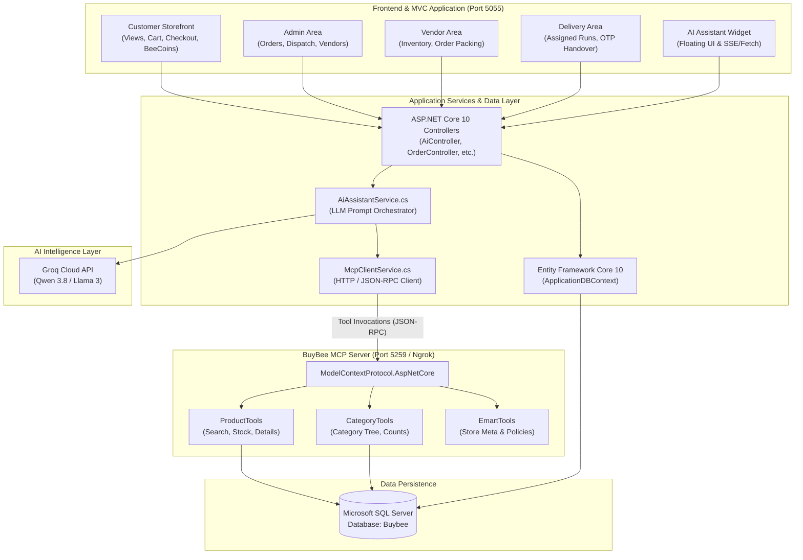
```mermaid
flowchart TB
    subgraph ClientLayer["Frontend & MVC Application (Port 5055)"]
        CustomerUI["Customer Storefront\n(Views, Cart, Checkout, BeeCoins)"]
        AdminArea["Admin Area\n(Orders, Dispatch, Vendors)"]
        VendorArea["Vendor Area\n(Inventory, Order Packing)"]
        DeliveryArea["Delivery Area\n(Assigned Runs, OTP Handover)"]
        AIAssistantWidget["AI Assistant Widget\n(Floating UI & SSE/Fetch)"]
    end

    subgraph CoreBackend["Application Services & Data Layer"]
        MVCController["ASP.NET Core 10 Controllers\n(AiController, OrderController, etc.)"]
        AiService["AiAssistantService.cs\n(LLM Prompt Orchestrator)"]
        McpClient["McpClientService.cs\n(HTTP / JSON-RPC Client)"]
        EFCore["Entity Framework Core 10\n(ApplicationDBContext)"]
    end

    subgraph ExternalAI["AI Intelligence Layer"]
        GroqAPI["Groq Cloud API\n(Qwen 3.8 / Llama 3)"]
    end

    subgraph MCPServer["BuyBee MCP Server (Port 5259 / Ngrok)"]
        MCPApp["ModelContextProtocol.AspNetCore"]
        ProductTools["ProductTools\n(Search, Stock, Details)"]
        CategoryTools["CategoryTools\n(Category Tree, Counts)"]
        EmartTools["EmartTools\n(Store Meta & Policies)"]
    end

    subgraph DatabaseLayer["Data Persistence"]
        SQLServer[("Microsoft SQL Server\nDatabase: Buybee")]
    end

    CustomerUI --> MVCController
    AdminArea --> MVCController
    VendorArea --> MVCController
    DeliveryArea --> MVCController
    AIAssistantWidget --> MVCController

    MVCController --> AiService
    MVCController --> EFCore
    AiService --> GroqAPI
    AiService --> McpClient

    McpClient -- "Tool Invocations (JSON-RPC)" --> MCPApp
    MCPApp --> ProductTools
    MCPApp --> CategoryTools
    MCPApp --> EmartTools

    ProductTools --> SQLServer
    CategoryTools --> SQLServer
    EFCore --> SQLServer
```

---

## 📸 Visual Showcase & Screenshots

### Storefront & Catalog

| Homepage & Hero Experience | Dynamic Product Catalog & Filtering |
|:---:|:---:|
| 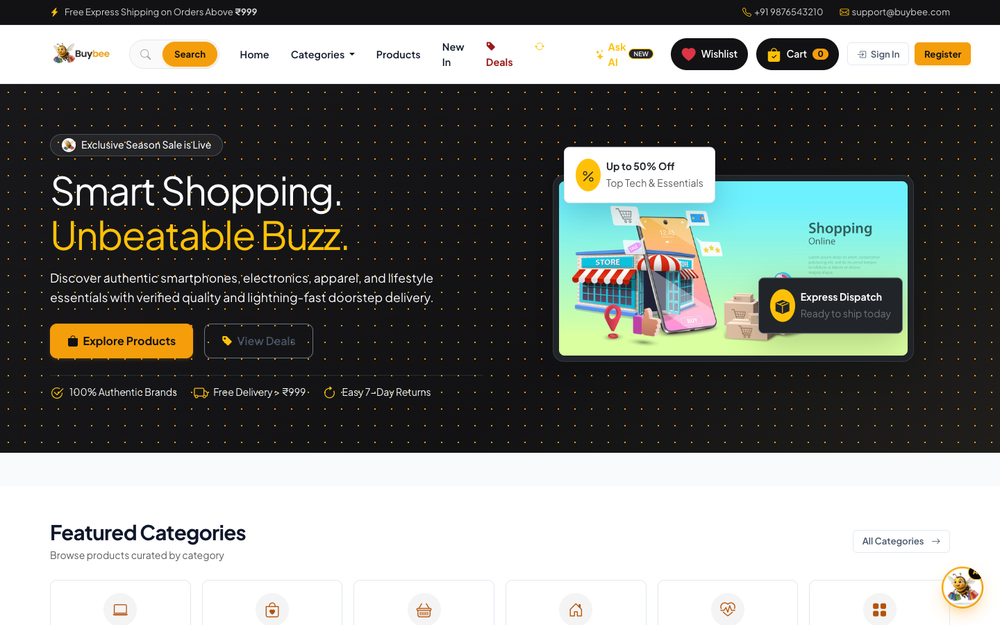 | 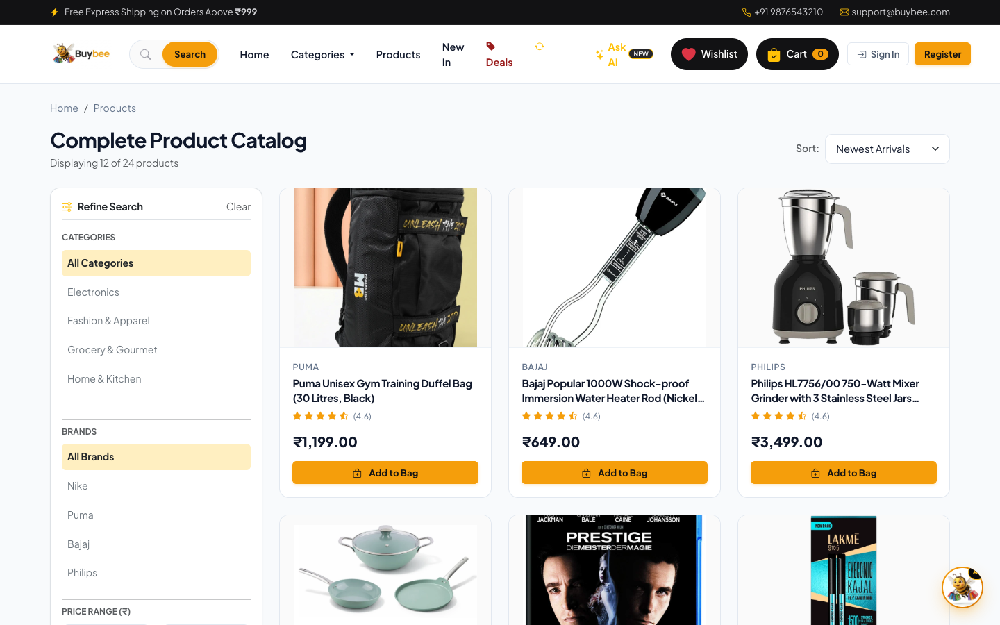 |
| *Modern hero banners, featured categories, trending brands, and floating AI assistant.* | *Facet filters, search bar, stock levels, BeeCoins reward indicators, and price ranges.* |

---

### Complete End-to-End Order Lifecycle

BuyBee tracks every transaction across all 4 roles with high-fidelity UI states:

#### Phase 1: Shopping & Checkout
| Step 1: Customer Cart & Items | Step 2: Checkout & Delivery Address | Step 3: Order Placed & Confirmed |
|:---:|:---:|:---:|
| 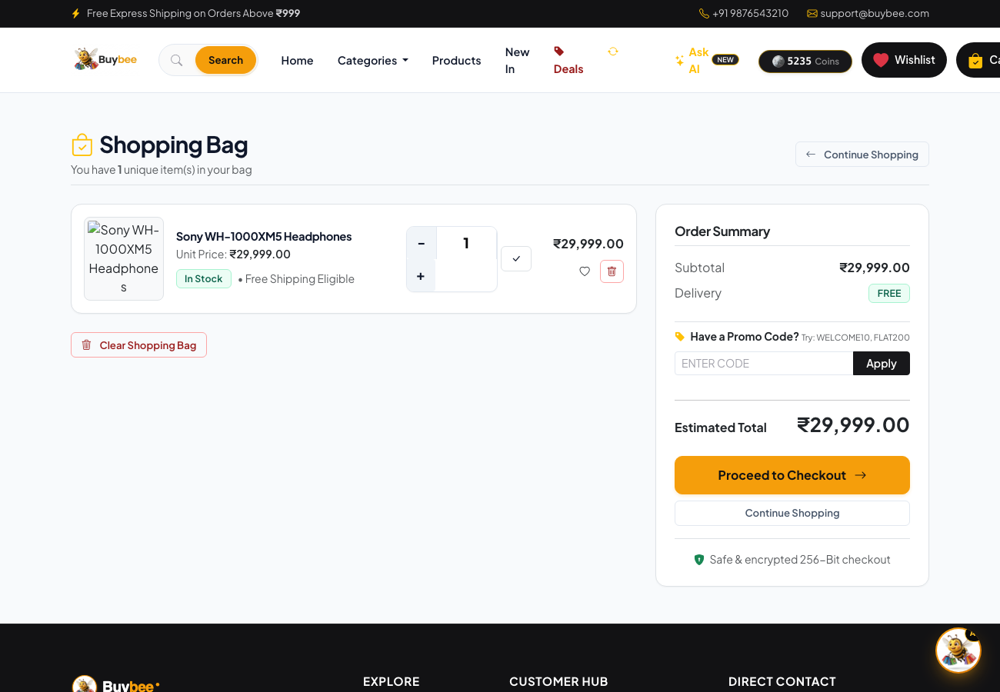 | 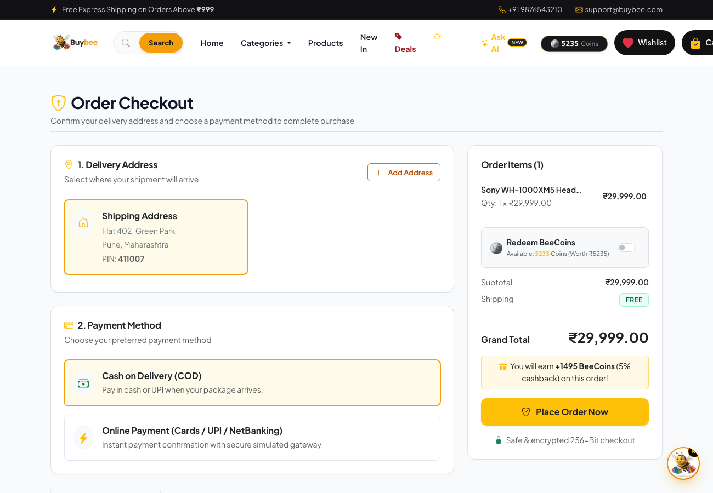 | 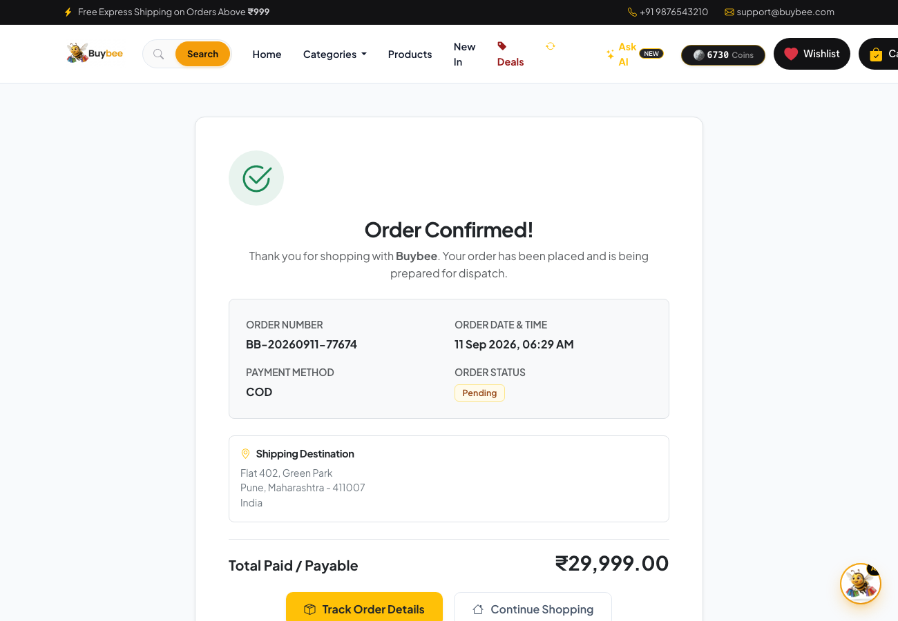 |
| *Real-time cart calculation, quantity adjustments, and savings recap.* | *Address selection, pincode delivery estimation, payment method, and BeeCoin redemption.* | *Immediate confirmation screen with generated Order ID and initial status.* |

#### Phase 2: Live Tracking & Fulfillment
| Step 4: Customer Order Details | Step 5: Live Order Tracking Timeline | Step 6: Vendor Order Packing |
|:---:|:---:|:---:|
| 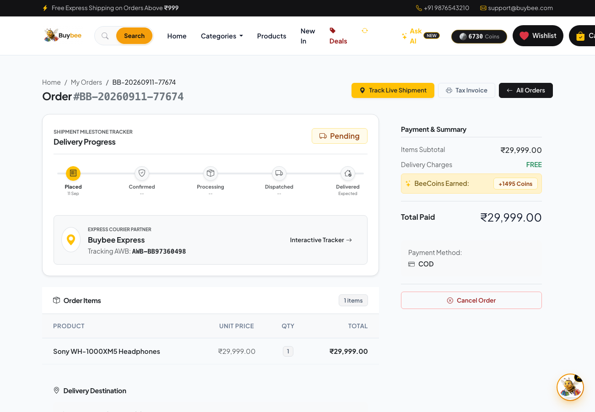 | 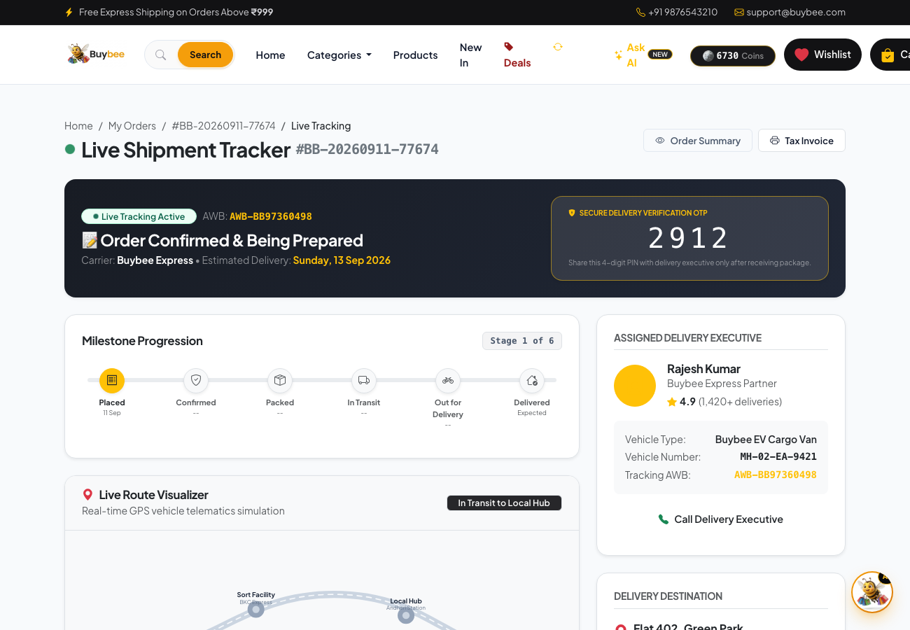 | 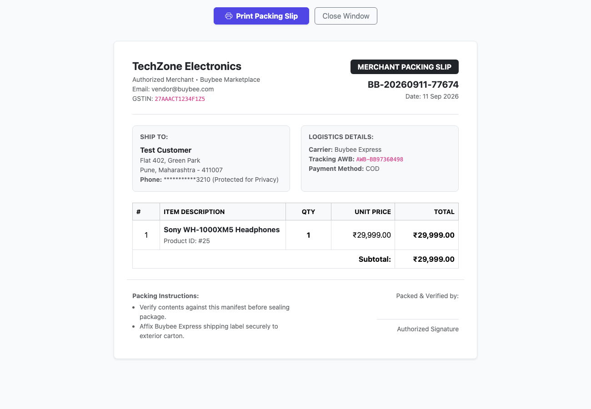 |
| *Itemized summary, shipping address, vendor allocation, and total billing.* | *Visual progress stepper showing real-time milestone transitions.* | *Vendor area dashboard where sellers confirm item packaging.* |

#### Phase 3: Dispatch & Logistics
| Step 7: Admin Order Dispatch | Step 8: Delivery Partner Assignment | Step 9: Delivery Partner Starts Run |
|:---:|:---:|:---:|
| 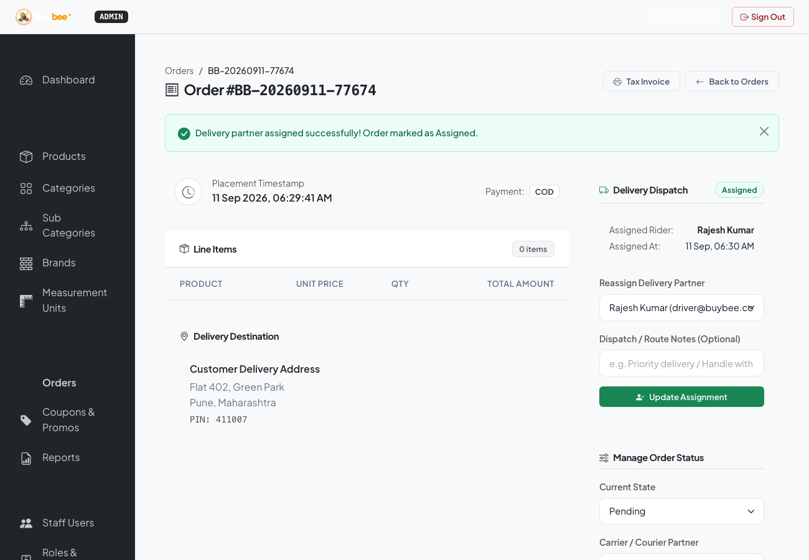 | 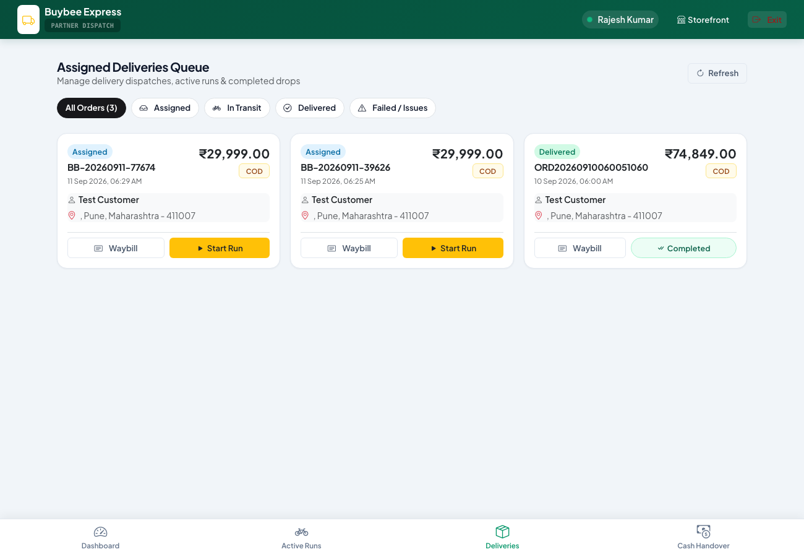 | 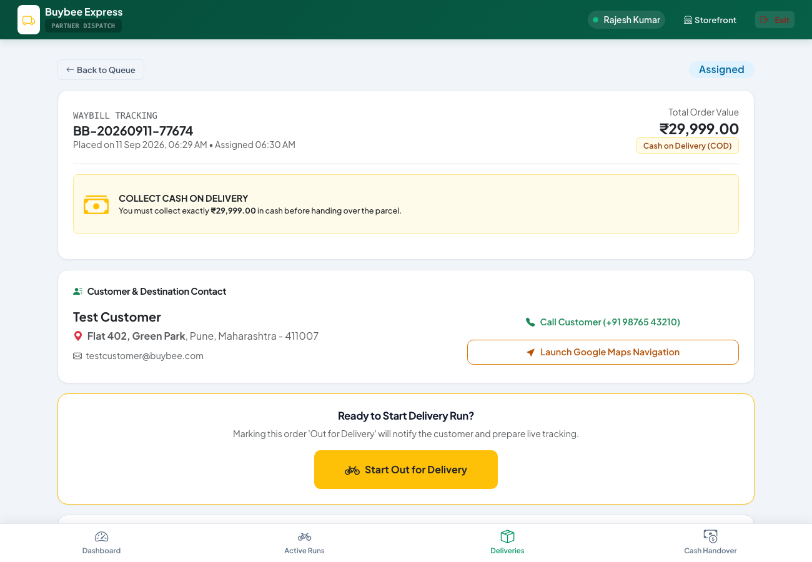 |
| *Admin verifies packed packages and assigns orders to available delivery drivers.* | *Driver portal displaying assigned packages, destinations, and delivery priorities.* | *Driver marks the shipment as 'In Transit' to notify customer.* |

#### Phase 4: Last-Mile Delivery & Handover
| Step 10: Customer 'Out For Delivery' Alert | Step 11: Secure OTP Handover Verification | Step 12: Order Completed | Step 13: Customer Tax Invoice |
|:---:|:---:|:---:|:---:|
| 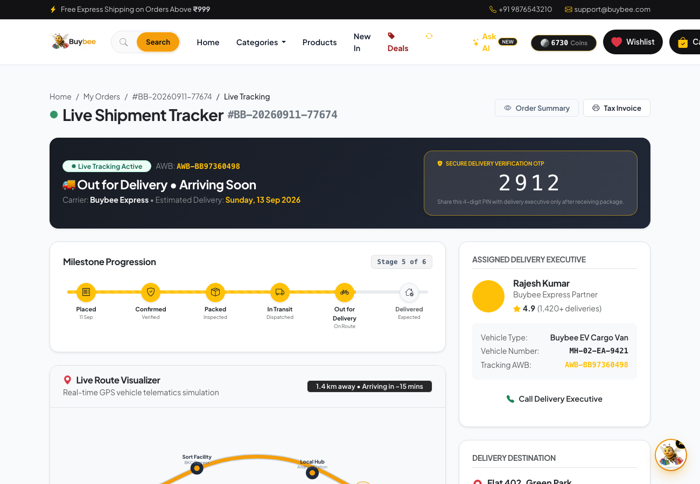 | 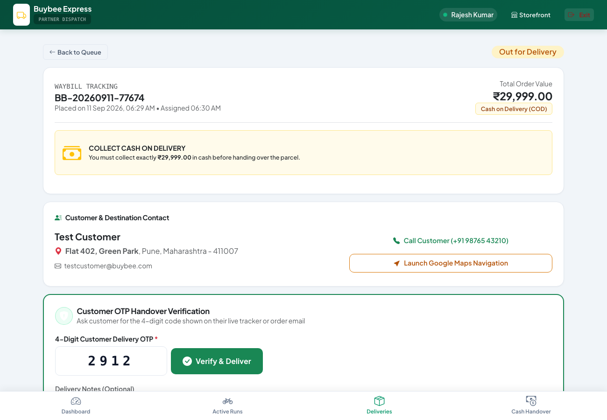 | 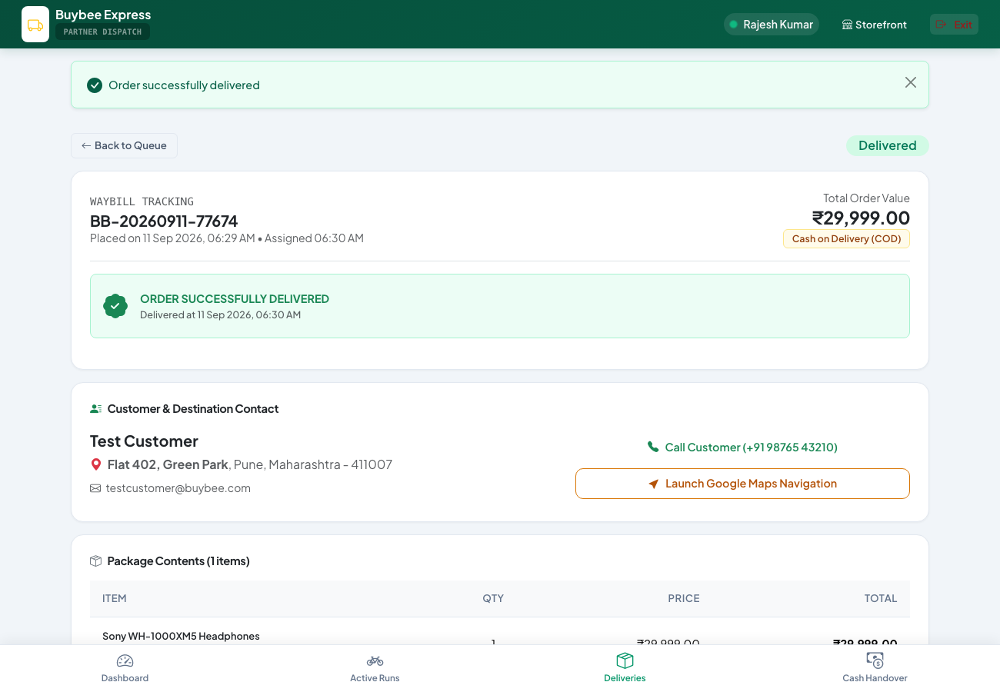 | 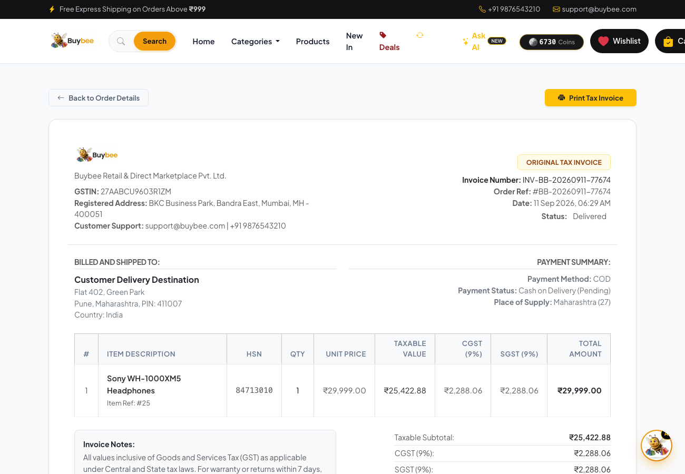 |
| *Customer sees driver details, ETA, and confidential delivery OTP.* | *Driver enters the customer's one-time code to prevent fraud.* | *Instant status update across all portals upon valid OTP entry.* | *Downloadable/printable itemized invoice with GST and BeeCoins applied.* |

---

## ⚡ Role-Based Portals & Modules

### 1. Customer Storefront
- **Dynamic Search & Filtering:** Filter by Category, Subcategory, Brand, Price, and In-Stock availability.
- **BeeCoins Rewards System:** Customers earn BeeCoins on every completed purchase, which can be applied for cash discounts at checkout.
- **Wallet & Transactions History:** Real-time ledger of earned and redeemed loyalty coins.
- **Reviews & Ratings:** Verified buyers can leave stars and written reviews for items.
- **Interactive Cart & Wishlist:** Mini-cart slideouts, instant quantity increments, and wishlist persistence.

### 2. AI Shopping Assistant (MCP + Groq)
- **Conversational Queries:** "Show me ergonomic office chairs under 15,000" or "Is Sony WH-1000XM4 in stock?"
- **Autonomous Tool-Calling:** AI assistant autonomously queries `BuyBee.MCP.Server` to retrieve real-time inventory and pricing without hallucinating product data.
- **Floating Widget:** Embedded floating assistant across all pages with quick-suggestion prompt chips.

### 3. Vendor Management Portal (`/Vendor`)
- **Inventory Control:** Add, update, and manage product listings and stock quantities.
- **Fulfillment Pipeline:** View newly placed orders, mark items as "Packed", and generate packaging labels.
- **Sales Analytics:** Review store revenue and popular product velocity.

### 4. Admin Operations Hub (`/Admin`)
- **Platform Oversight:** Supervise all orders, vendors, customer accounts, and delivery fleets.
- **Order Dispatcher:** Assign packed orders to active delivery agents based on locality/pincode.
- **Category & Brand Management:** Configure store taxonomies and promo banners.

### 5. Delivery Partner Portal (`/Delivery`)
- **Mobile-Responsive Run Sheet:** Delivery agents view pending drops, customer contact info, and navigation addresses.
- **Secure OTP Verification:** The driver cannot mark an order delivered without inputting the customer's secure delivery OTP.

---

## 💻 Tech Stack

| Layer | Technologies |
|:---|:---|
| **Backend Framework** | C# 13, .NET 10.0, ASP.NET Core MVC |
| **Microservices / Protocols** | Model Context Protocol (`ModelContextProtocol.AspNetCore` v2.1.0) |
| **AI / LLM Orchestration** | Groq Cloud API (`qwen/qwen3.8-27b`, `openai/gpt-oss-120b`, `llama-3`) |
| **ORM & Database** | Entity Framework Core 10.0, Microsoft SQL Server, Microsoft.Data.SqlClient |
| **Frontend & UI** | Razor Views, Bootstrap 5, Vanilla JavaScript, CSS3 Glassmorphism |
| **Security & Auth** | ASP.NET Core Identity & Cookie Authentication, Anti-Forgery Tokens, Role Authorization |
| **Tools & Tunneling** | Ngrok (for public MCP endpoint tunneling), Swagger / OpenAPI |

---

## 📂 Project Directory Structure

```text
AI/
├── BuyBee.MVC.Client/              # Main ASP.NET Core 10 Web Application
│   ├── Areas/                      # Role-segregated application modules
│   │   ├── Admin/                  # Super Admin controllers & views
│   │   ├── Delivery/               # Delivery personnel controllers & views
│   │   └── Vendor/                 # Vendor management controllers & views
│   ├── Controllers/                # Customer storefront controllers
│   ├── Data/                       # EF Core DbContext & configurations
│   ├── Models/                     # Domain entities (Products, Orders, BeeCoins, Users)
│   ├── Services/                   # Business logic (AiAssistantService, McpClientService)
│   ├── ViewModels/                 # Strongly-typed view models
│   ├── Views/                      # Customer storefront Razor templates
│   ├── wwwroot/                    # Static assets (css, js, images, logos, uploads)
│   ├── .env.example                # Clean template for required environment variables
│   ├── appsettings.json            # Application configuration & connection strings
│   └── Program.cs                  # Client dependency injection & pipeline setup
│
├── BuyBee.MCP.Server/              # Model Context Protocol (MCP) Server
│   ├── Tools/                      # MCP Tool definitions (ProductTools, CategoryTools)
│   ├── Models/                     # Tool request/response contracts
│   ├── Services/                   # Database query services for MCP
│   ├── appsettings.json            # MCP server configuration & DB connection
│   └── Program.cs                  # MCP server bootstrapping & tool registration
│
├── docs/                           # Documentation assets
│   ├── images/                     # Logos and brand graphics
│   └── screenshots/                # Showcase & step-by-step order flow captures
│
├── .gitignore                      # Comprehensive protection against secrets & build artifacts
└── README.md                       # Project documentation
```

---

## 🚀 Getting Started & Local Setup

### Prerequisites
- [.NET 10.0 SDK](https://dotnet.microsoft.com/download/dotnet/10.0) or later
- [Microsoft SQL Server](https://www.microsoft.com/sql-server) (LocalDB, SQL Express, or Docker container)
- A [Groq Cloud API Key](https://console.groq.com/) (for the AI Shopping Assistant)
- Optional: [Ngrok](https://ngrok.com/) (if exposing the local MCP server over a public URL)

---

### 1. Clone & Configure Environment

```bash
# 1. Clone the repository
git clone https://github.com/your-username/BuyBee.git
cd BuyBee

# 2. Configure environment variables for the MVC Client
cp BuyBee.MVC.Client/.env.example BuyBee.MVC.Client/.env
```

Open `BuyBee.MVC.Client/.env` and insert your Groq API Key:
```env
GROQ_API_KEY=gsk_your_actual_groq_api_key_here
```

---

### 2. Database Setup

Ensure your SQL Server is running, then check the connection string in `BuyBee.MVC.Client/appsettings.json`:
```json
"ConnectionStrings": {
  "DBCS": "Server=localhost,1433;Database=Buybee;User Id=SA;Password=YourPassword123;TrustServerCertificate=True;Encrypt=False;"
}
```

Apply migrations or create the database:
```bash
cd BuyBee.MVC.Client
dotnet ef database update
cd ..
```

---

### 3. Launch the MCP Server

The MCP Server exposes tool-calling endpoints for the AI Assistant:

```bash
cd BuyBee.MCP.Server
dotnet run
```
*The MCP server starts listening on `http://localhost:5259`.*

> **Tip (Optional Ngrok Tunnel):** If using a public tunnel for remote MCP clients:
> ```bash
> ngrok http http://localhost:5259
> ```
> Update `"NgrokUrl"` in `BuyBee.MVC.Client/appsettings.json` with your generated URL.

---

### 4. Launch the Web Application

In a separate terminal, start the MVC Client:

```bash
cd BuyBee.MVC.Client
dotnet run
```

Open your browser and navigate to:
👉 **[http://localhost:5055](http://localhost:5055)**

---

## 🤖 Model Context Protocol (MCP) Tools

The `BuyBee.MCP.Server` exposes specialized tools registered via `ModelContextProtocol.AspNetCore`:

| Tool Name | Parameters | Purpose |
|:---|:---|:---|
| `search_products` | `query`, `categoryId`, `maxPrice` | Performs keyword and facet search across active product listings. |
| `get_product_stock` | `productId` | Returns exact current inventory count for a given item. |
| `get_product_details` | `productId` | Retrieves full specs, price, discounts, and vendor details. |
| `get_category_tree` | *None* | Retrieves the nested hierarchy of available shopping categories. |
| `check_pincode_serviceability` | `pincode` | Checks if BuyBee's delivery fleet services the given postal code. |

The `AiAssistantService` uses a multi-turn tool-call loop to invoke these tools via JSON-RPC, parsing live data directly into the assistant's context.

---

## 🔒 Security & Environment Hygiene

This project enforces strict security standards:
- **Zero Committed Secrets:** All `.env`, `*.key`, `cookies.txt`, and user credential files are excluded via the root [`.gitignore`](file:///.gitignore).
- **Safe Templates:** Only sanitized templates (`.env.example`) are version-controlled.
- **Anti-Tampering:** Delivery handovers require real-time 6-digit OTP verification known only to the authenticated customer.

---

## 📄 License

This project is licensed under the [MIT License](LICENSE). Built for educational and commercial enterprise e-commerce demonstration.
